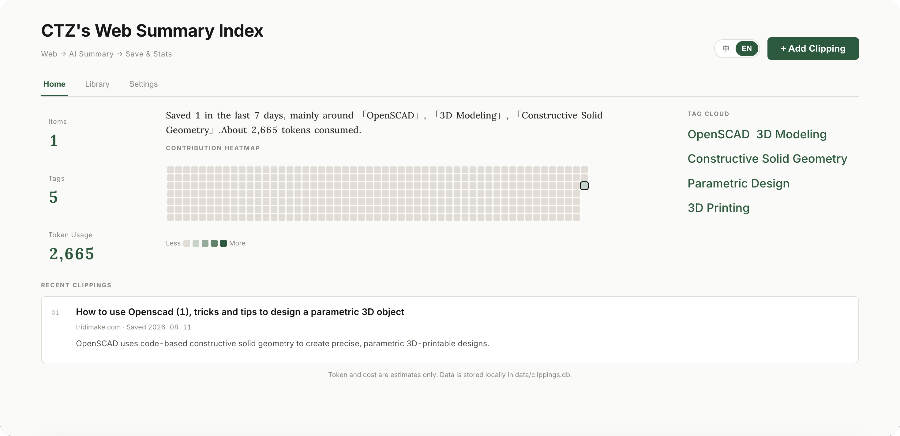
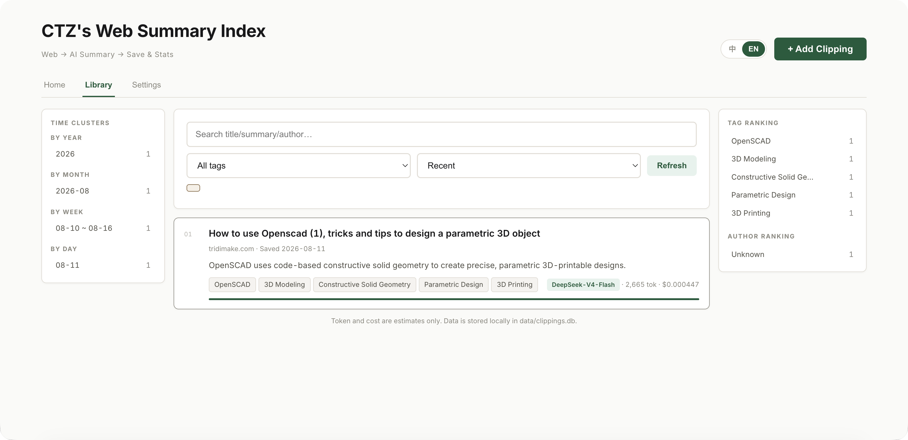

# 📚 CTZ's Web Summary Index

输入网址 → 自动抓取网页 → AI 生成摘要 → 永久收藏、统计与可视化。
Enter a URL → auto-fetch the page → AI generates a summary → save, analyze, and visualize forever.

每一个剪藏都包含：**标题、作者、发布平台、发布时间、文章目录、摘要、标签、生成模型、Token 用量、预估费用、原文链接**。
Each clipping stores: **title, authors, publishing platform, publish date, article outline, summary, tags, model used, token usage, estimated cost, and source link**.

> 📝 规划中的功能与迭代想法见 [TODO.md](./TODO.md) · Planned features and ideas live in [TODO.md](./TODO.md)

## 🖼️ 演示 / Demo


*首页：条目计数、贡献热力图、标签云、最近剪藏*
*Home: counts, contribution heatmap, tag cloud, recent clippings*


*剪藏库：时间聚类、搜索筛选、列表与排行*
*Library: time clusters, search/filter, list and rankings*

---

## 🌐 语言 / Language

界面支持中英文切换，右上角「中 / EN」一键切换；首次访问按浏览器语言自动判断。AI 摘要也跟随当前界面语言生成，且**中英文剪藏分别存储与筛选**——切到英文界面只看到英文生成的剪藏，反之亦然。

The UI supports Chinese/English toggle via the top-right "中 / EN" switch; the first visit auto-detects from your browser language. AI summaries are generated in the current UI language, and **clippings are stored and filtered by language** — switching to English shows only clippings generated under English, and vice versa.

---

## ✨ 功能 / Features

### 总结生成 / Summary Generation
- 📥 自动抓取网页正文（基于 Firefox 阅读模式算法，剔除导航/广告噪声）
  Auto-extract page body (Firefox Readability algorithm; strips nav/ads)
- 🔍 自动提取元数据：作者、发布平台、发布时间、文章目录大纲（H1-H3）
  Auto-extract metadata: authors, platform, publish date, outline (H1–H3)
- 🤖 AI 生成结构化摘要（核心观点 + 关键要点）+ 自动标签
  AI structured summary (core gist + key points) + auto tags
- 🔀 多服务商 / 多模型自由切换（智谱 GLM、并行 paratera 等）
  Switch freely across providers/models (Zhipu GLM, Paratera, etc.)
- 📊 实时显示 Token 用量与费用估算
  Real-time token usage & cost estimate

### 剪藏库（SQLite 持久化）/ Library (SQLite)
- 💾 一键保存剪藏，永久存储于本地 `data/clippings.db`
  One-click save, persisted locally in `data/clippings.db`
- 🔎 全文搜索（标题/摘要/作者）+ 标签筛选 + 排序（最近/Token/费用）
  Full-text search (title/summary/author) + tag filter + sort (recent/tokens/cost)
- 📄 详情查看：完整摘要、文章目录、原文链接、用量详情
  Detail view: full summary, outline, source link, usage breakdown
- 🏷️ 标签随时增删编辑（保存前后均可）
  Edit tags anytime (before or after saving)
- 🗑️ 一键删除（带确认）
  Delete with confirmation

### 统计与可视化 / Stats & Visualization
- 📈 Token 用量趋势图（原生 Canvas 折线图）
  Token-usage trend chart (native Canvas line chart)
- 🔀 三种指标切换：Token / 费用 / 剪藏数
  Three metrics: Token / Cost / Count
- 📊 按模型、按平台分布
  Distribution by model and by platform
- 🏷️ 热门标签云（可点击跳转筛选）
  Tag cloud (click to filter)
- 🔥 贡献热力图（GitHub 风格，近 365 天）
  Contribution heatmap (GitHub-style, last 365 days)

---

## 🚀 快速开始 / Quick Start

### 0. 前置要求 / Prerequisites
- **Node.js ≥ 18**（用到了原生 `fetch`、`AbortSignal.timeout` 等）/ Uses native `fetch`, `AbortSignal.timeout`
- 一个可用的 AI 服务商 API Key（智谱 GLM 或并行 paratera，注册即有免费额度）
  An AI provider API Key (Zhipu GLM or Paratera; free tier on signup)

### 1. 安装依赖并启动 / Install & Run

```bash
npm install
npm start
# 或开发模式（文件改动自动重启）/ or dev mode (auto-restart on file change)
npm run dev
```

首次启动会自动创建 `data/` 目录和 `data/clippings.db` 数据库，无需手动准备。打开 http://localhost:3000 。
First launch auto-creates `data/` and `data/clippings.db`. Open http://localhost:3000 .

### 2. 在页面配置服务商 / Configure a Provider

首次打开会提示尚未配置服务商。点顶部「⚙️ 设置」Tab：
On first open you'll be prompted to configure a provider. Go to the top **⚙️ Settings** tab:

1. 点「+ 添加服务商」/ Click "+ Add Provider"
2. 从内置预设选一个（智谱 GLM / 并行 paratera），表单会自动填好 Base URL 和模型列表
   Pick a built-in preset (Zhipu GLM / Paratera); Base URL and model list auto-fill
3. 只需填入你的 **API Key**（可在对应平台注册获取）
   Enter your **API Key** (from the provider's console)
4. 点「测试连接」验证 Key 是否有效 / Click "Test Connection" to verify
5. 「保存」即可回到首页使用 / "Save", then start summarizing

也可以添加任意 OpenAI 兼容的自定义服务商（填 Base URL + Key + 模型名）。
You can also add any OpenAI-compatible custom provider (Base URL + Key + model name).

> **Key 存哪里？** 仅保存在你当前浏览器（localStorage），不进服务器、不落盘、不进 git。换浏览器需重新填写。公共电脑不建议使用。
> **Where is the Key stored?** Only in your current browser (localStorage) — never sent to the server, persisted, or committed. Re-enter when switching browsers. Not recommended on shared computers.

### （可选）服务端预配置 / (Optional) Server-side Preset

若想让所有访问者共享同一套 Key（如团队部署），可在 `.env` 配置：
To share one set of keys across all visitors (e.g. team deploy), configure `.env`:

```bash
cp .env.example .env
# 编辑 .env 填 ZHIPU_API_KEY / PARATERA_API_KEY
# Edit .env: set ZHIPU_API_KEY / PARATERA_API_KEY
```

前端未配置时自动回退到 `.env`。
Falls back to `.env` when the frontend has no provider configured.

---

## 🧱 技术架构 / Architecture

```
前端（Tab：首页 / 剪藏库 / 设置）        后端（Express，无状态转发）
  ├─ 原生 HTML/CSS/JS                       ├─ 网页抓取：Node 原生 fetch
  ├─ 原生 Canvas 折线图（零依赖）  ←→      ├─ 正文提取：@mozilla/readability + jsdom
  ├─ localStorage 存服务商配置+Key          ├─ 元数据：Open Graph / meta / <time>
  ├─ i18n.js 中英文切换                    ├─ 大纲提取：DOM H1-H4 + 编号 fallback
  └─ 请求时把 Key 传给后端转发              ├─ AI 调用：OpenAI 兼容接口（用前端传入的 Key 转发）
                                            ├─ i18n：按 X-Lang 头本地化错误 + 摘要语言
                                            └─ 持久化：SQLite（better-sqlite3，按 lang 分区）

Frontend (tabs: Home / Library / Settings)  Backend (Express, stateless proxy)
  ├─ vanilla HTML/CSS/JS                    ├─ fetch: native Node fetch
  ├─ native Canvas line chart (no deps) ←→   ├─ body: @mozilla/readability + jsdom
  ├─ localStorage for provider+Key           ├─ metadata: Open Graph / meta / <time>
  ├─ i18n.js zh/en toggle                    ├─ outline: DOM H1-H4 + numbered fallback
  └─ forwards Key to backend per request     ├─ AI: OpenAI-compatible (proxy with caller's Key)
                                             ├─ i18n: X-Lang header → localized errors + summary lang
                                             └─ SQLite (better-sqlite3), partitioned by lang
```

后端不持有 API Key，只做无状态转发——不同浏览器各自带自己的 Key，互不干扰。
The backend holds no API Key; it only proxies statelessly — each browser carries its own Key.

所有 AI 服务商均使用 OpenAI 兼容接口，底层调用逻辑一套通吃，新增服务商只需在 `config/providers.js` 追加配置。
All AI providers use OpenAI-compatible APIs, so one calling path serves all. Adding a provider only requires appending to `config/providers.js`.

---

## 📁 目录结构 / Project Structure

```
web-summary/
├── server.js                  # Express 入口 / Express entry
├── config/
│   ├── providers.js           # 服务商 + 模型配置 / providers + models
│   └── pricing.js             # 定价表（元/百万 token，可编辑）/ pricing table (editable)
├── src/
│   ├── extract.js             # 抓取 + 正文/元数据/大纲提取 / fetch + body/metadata/outline
│   ├── llm.js                 # 统一 LLM 调用（含摘要 prompt 双语）/ unified LLM call (zh/en prompts)
│   ├── usage.js               # Token 统计 + 费用计算 / token stats + cost calc
│   ├── db.js                  # SQLite 封装（建表/CRUD/统计，按 lang 分区）/ SQLite (lang-partitioned)
│   ├── i18n.js                # 后端 i18n（错误信息本地化）/ backend i18n (localized errors)
│   └── router/
│       ├── clippings.js       # 剪藏 CRUD 路由 / clippings CRUD routes
│       └── stats.js           # 统计 + 趋势路由 / stats + trend routes
├── public/
│   ├── index.html             # 主页面 / main page
│   ├── style.css              # 样式 / styles
│   ├── i18n.js                # 前端 i18n（中英字典）/ frontend i18n (zh/en dict)
│   ├── app.js                 # 前端交互 / frontend logic
│   └── chart.js               # Canvas 折线图 / Canvas chart
├── screenshots/               # README 演示截图 / README demo screenshots
│   ├── home.png
│   └── library.png
└── data/
    └── clippings.db           # SQLite 数据库（运行时生成，git 忽略）/ runtime-generated, gitignored
```

---

## 📋 剪藏字段 / Clipping Fields

每个剪藏保存以下信息 / Each clipping stores:

| 字段 / Field | 说明 / Description | 来源 / Source |
|------|------|------|
| 标题 / Title | 文章标题 / article title | 网页 meta / Readability |
| 作者 / Authors | 文章作者 / article authors | `article:author` 等 meta / JSON-LD |
| 发布平台 / Platform | 站点名 / site name | `og:site_name` 或域名 / or domain |
| 发布时间 / Publish date | 原文发布日期 / publish date | `article:published_time` / `<time>` |
| 目录 / Outline | 文章章节大纲 / section outline | DOM H1-H4 提取 / DOM headings |
| 摘要 / Summary | 结构化摘要 / structured summary | AI 生成 / AI |
| 一句话总结 / One-liner | 核心一句话概括 / one-sentence gist | AI 生成 / AI |
| 标签 / Tags | 3-5 个主题标签 / 3-5 topic tags | AI 生成 + 可编辑 / AI + editable |
| 模型 / Model | 生成摘要的模型 / model used | 记录所选模型 / recorded |
| Token 用量 / Tokens | 输入/输出/总计 / in/out/total | API 响应 `usage` / API response |
| 预估费用 / Cost | 人民币估算 / CNY estimate | Token × 定价表 / tokens × pricing |
| 语言 / Lang | 摘要生成语言 / summary language | 界面语言 / UI lang (zh/en) |
| 原文链接 / Source URL | URL | 用户输入 / user input |

---

## ➕ 新增服务商 / 模型 · Add a Provider / Model

1. 在 `config/providers.js` 追加 / Append to `config/providers.js`:

```js
{
  id: 'myprovider',
  name: '我的服务商 / My Provider',
  baseUrl: 'https://api.example.com/v1',
  apiKeyEnv: 'MYPROVIDER_API_KEY',
  models: [{ group: '分组名 / Group', items: ['model-a', 'model-b'] }]
}
```

2. 在 `.env` 加入 `MYPROVIDER_API_KEY=xxx` / Add `MYPROVIDER_API_KEY=xxx` to `.env`
3. （可选）在 `config/pricing.js` 补充定价用于费用估算
   (Optional) Add pricing in `config/pricing.js` for cost estimation

重启服务即可。Restart the server.

---

## 💰 关于费用估算 / Cost Estimation

- 定价表 `config/pricing.js` 数值来自各模型官方公开价（元/百万 token），仅供估算参考
  Values in `config/pricing.js` come from official public prices (CNY per million tokens); for reference only
- paratera 实际计费以其账户后台为准
  Paratera's actual billing is per its account console
- 未在定价表中的模型，UI 显示「价格未知」，仅展示 Token 用量
  Models absent from the pricing table show "Price unknown" with token usage only
- 想调整价格，直接编辑 `config/pricing.js`，无需改代码
  To adjust prices, edit `config/pricing.js` directly — no code changes

---

## 🔒 安全说明 / Security

- API Key 有两种存放方式，按优先级生效 / Two storage options, by priority:
  1. **前端 localStorage**（默认）：Key 仅存于你当前浏览器，请求时随调用转发给后端，**不落盘、不进 git**。换浏览器需重新填写，公共电脑不建议使用。
     **Frontend localStorage** (default): Key stays in your browser, forwarded per request — **never persisted or committed**. Re-enter on browser switch; not for shared computers.
  2. **后端 `.env`**（兜底 / 团队共享）：前端未配置时回退读取 `.env`，适合多人共用部署。
     **Backend `.env`** (fallback / team-shared): used when the frontend has no config; suitable for shared deployments.
- 后端做无状态转发，不持久化任何 Key，不同浏览器各自的 Key 互不干扰。
  The backend is a stateless proxy; it persists no Key — browsers don't interfere with each other.
- `.env` 与 `data/` 均在 `.gitignore` 中，不会被提交。
  Both `.env` and `data/` are gitignored.
- 仅允许 http/https 协议的网址 / Only http/https URLs are allowed.
- 抓取设有 10 秒超时 / Fetch has a 10s timeout.
- 所有数据保存在本地，不上传任何第三方 / All data stays local; nothing is uploaded to third parties.

---

## 🛠️ 开发 / Development

```bash
npm run dev    # 文件改动自动重启 / auto-restart on file change
```

数据备份：直接复制 `data/clippings.db` 文件即可。
Backup: just copy the `data/clippings.db` file.
